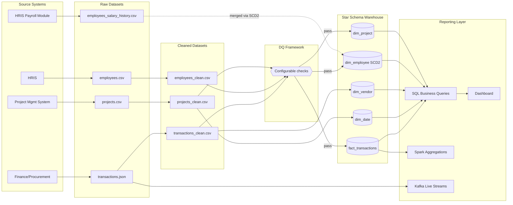

# Presight - Data Governance Document

**Author:** Akanksha Shreya
**Scope:** projects, employees, transactions, employees_salary_history

---

## Section 1 - Data Inventory

| Dataset | Source system | Format | Update frequency | Volume estimate | Daily growth |
|---|---|---|---|---|---|
| projects | Project Management System | CSV | Daily batch | ~500 rows | ~1-3/day |
| employees | HRIS | CSV | Daily batch | ~1,000 rows | Low, ~0-2/day |
| transactions | Finance/Procurement system | JSON | Near real-time | ~50,000 rows | ~100-300/day |
| employees_salary_history | HRIS payroll module | CSV | Event-triggered | ~1,800 rows | Low, ~5-10/day |

---

## Section 2 - Data Classification

Levels: Public, Internal, Confidential, Personal (PII).

### projects
| Column | Classification | Notes |
|---|---|---|
| project_id, project_name | Internal | |
| department, status, priority, region | Internal | |
| start_date, end_date, duration_days | Internal | |
| budget, actual_cost, budget_variance | Confidential | Financial data |
| project_manager_id | Internal | References employee_id |

### employees
| Column | Classification | Regulation |
|---|---|---|
| employee_id | Internal | - |
| full_name | Personal PII | GDPR, UAE PDPL |
| email | Personal PII | GDPR, UAE PDPL |
| department, role, level, region, status | Internal | - |
| hire_date | Internal | - |
| salary | Confidential | UAE PDPL |
| manager_id | Internal | References employee_id |
| years_experience | Internal | - |

### transactions
| Column | Classification | Notes |
|---|---|---|
| transaction_id, invoice_ref | Internal | |
| project_id, vendor_id, vendor_name, category | Internal | |
| amount, currency | Confidential | Financial data |
| transaction_date | Internal | |
| approved_by | Personal PII | GDPR, UAE PDPL |
| payment_status | Internal | |
| notes | Confidential | May contain sensitive commentary |

### employees_salary_history
| Column | Classification | Regulation |
|---|---|---|
| employee_id | Internal | - |
| previous_salary, new_salary | Personal PII plus Confidential | GDPR, UAE PDPL |
| previous_role, new_role, previous_level, new_level | Internal | |
| effective_date | Internal | - |
| change_type, change_reason | Confidential | |

---

## Section 3 - Data Ownership

| Dataset | Data Owner | Data Steward | Access approver |
|---|---|---|---|
| projects | Head of PMO | Senior Data Engineer | PMO Director |
| employees | Head of HR | HR Systems Administrator | Head of HR |
| transactions | Head of Finance | Finance Data Analyst | Finance Director |
| employees_salary_history | Head of HR | Payroll Lead | Head of HR plus Head of Finance |

Owner vs Steward: the Data Owner is the accountable business role with ultimate decision authority - they decide who should have access and are answerable for misuse. The Data Steward implements that policy day to day - maintaining quality, managing access controls, applying retention actions. The Owner sets the rules, the Steward runs them.

---

## Section 4 - Retention Policy

| Dataset | Retention period | Justification | Disposal method | Enforced by |
|---|---|---|---|---|
| projects | 7 years after closure | Business: historical analysis. Regulatory: UAE commercial record-keeping norms | Archive after 2 years, delete after 7 | Senior Data Engineer |
| employees | Employment plus 7 years post-termination | UAE Labour Law record retention requirements | Anonymise identifiers after window | HR Systems Administrator |
| transactions | 7 years | UAE tax law FTA retention requirements | Archive after 2 years, delete after 7 | Finance Data Analyst |
| employees_salary_history | 10 years after termination | See special consideration below | Archive, joint sign-off before disposal | Payroll Lead plus Head of Finance |

Special consideration - employees_salary_history.csv: this dataset carries a longer retention period than standard employee data because it supports two compliance needs: (1) UAE labour law - salary history is core evidence in end-of-service gratuity calculations and wage disputes, which can be raised years after termination; (2) tax and audit obligations - historical compensation may be needed for FTA audits that can look back several years. A 10-year post-termination retention window is a defensible conservative choice, and disposal should require joint HR and Finance sign-off rather than a unilateral delete.

---

## Section 5 - Access Control

| Persona | Projects | Employees | Transactions | Salary History |
|---|---|---|---|---|
| Data Engineer | Read plus Write | Read | Read plus Write | None |
| BI Analyst | Read | Read, excl salary | Read | None |
| Finance Team | Read | None | Read plus Write | Read, aggregated only |
| HR Team | None | Full incl delete | None | Full incl delete |
| Executive | Read | Read, excl salary | Read | None, aggregated reports only |

Justification (least privilege): Data Engineers need write access to projects and transactions for pipeline work but no legitimate need for salary history. BI Analysts need employee data for headcount reporting but never individual salary figures. Finance owns transactions but has no operational need for individual employee records, and their salary history visibility is aggregated only since compensation decisions sit with HR. HR Team is the only persona with full salary history access since compensation administration is their core function, though this access should be logged and periodically reviewed. Executives get broad read visibility for oversight but receive compensation insight only through approved aggregated reports.

---

## Section 6 - Data Lineage

Transformations happen raw to clean (null handling, type casting, derived columns) and clean to warehouse (SCD2 versioning, surrogate keys, dimensional modelling). Quality checks are applied by the DQ framework between cleaned CSVs and the warehouse load, making it a genuine control point rather than a downstream audit step.
